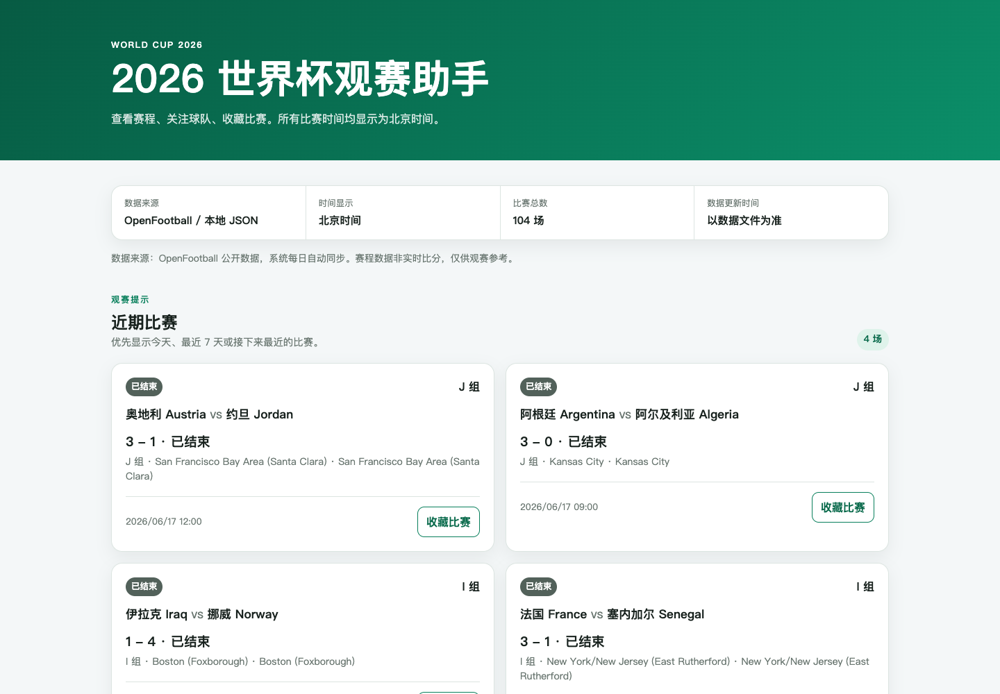
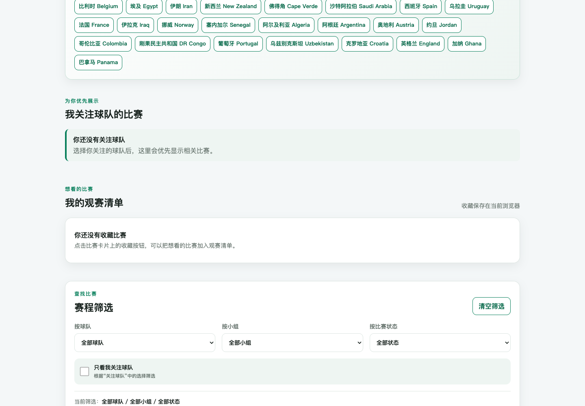
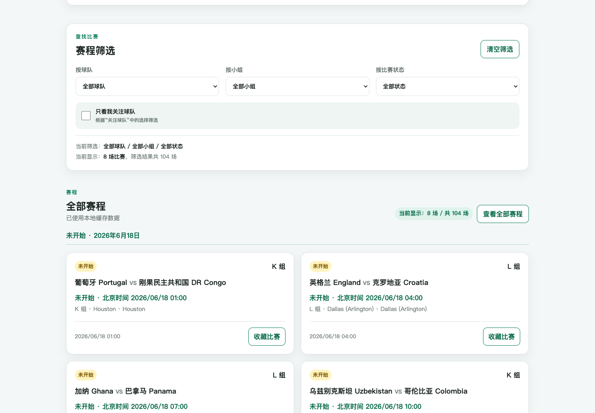
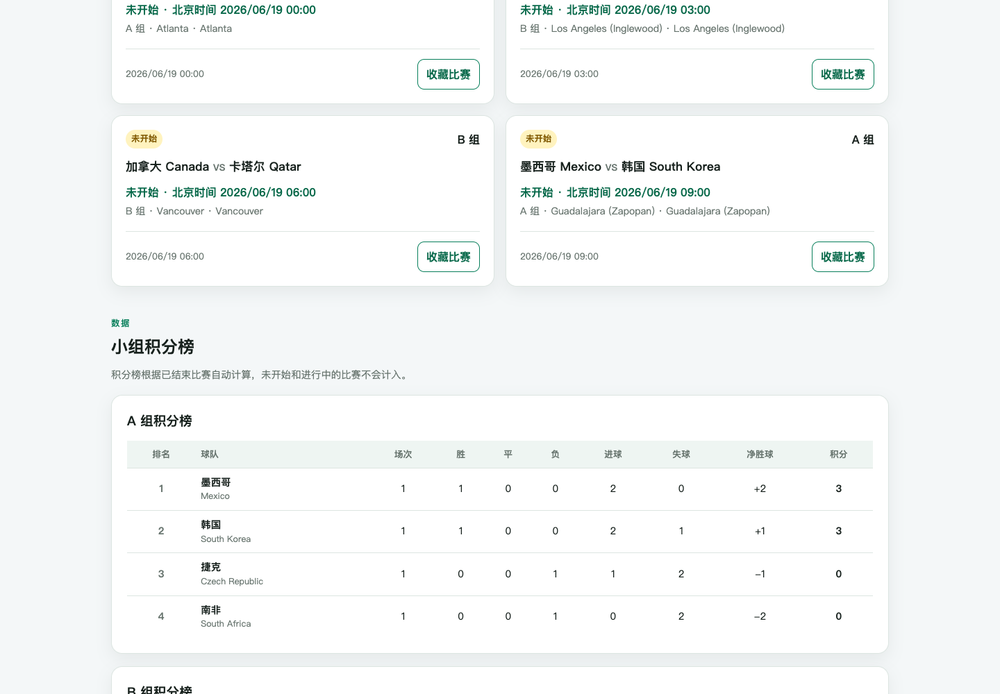
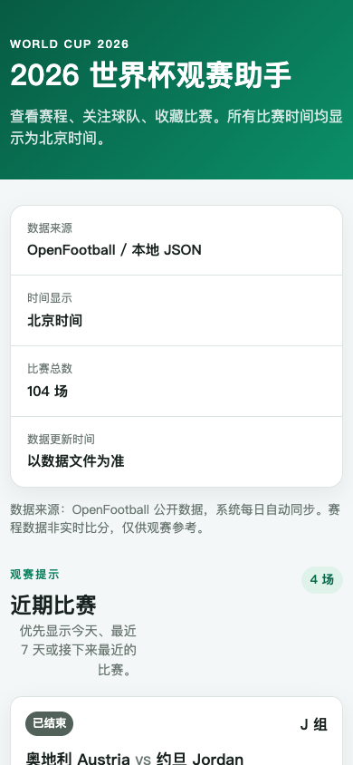

# 2026 世界杯观赛助手

一个使用原生 HTML、CSS、JavaScript 和 JSON 开发的世界杯观赛工具。它可以查看 2026 世界杯赛程、按球队/小组/状态筛选比赛、关注球队、收藏比赛，并根据已结束比赛自动计算小组积分榜。

这是项目的 `v1.0.0` 正式作品版：保留轻量静态网页结构，同时支持 Vercel 国际版、腾讯云 CloudBase 国内静态版和 GitHub Actions 自动同步数据。

## 在线访问

- 国际版：[https://world-cup-assistant-two.vercel.app/](https://world-cup-assistant-two.vercel.app/)
- 国内静态版：[https://world-cup-assistant-d2bce74d546c-1443033455.tcloudbaseapp.com/world-cup-assistant-cn/](https://world-cup-assistant-d2bce74d546c-1443033455.tcloudbaseapp.com/world-cup-assistant-cn/)
- 数据接口：[https://world-cup-assistant-two.vercel.app/api/matches](https://world-cup-assistant-two.vercel.app/api/matches)
- 比赛 JSON：[https://world-cup-assistant-two.vercel.app/data/matches.json](https://world-cup-assistant-two.vercel.app/data/matches.json)

## 作品亮点

- 近期比赛优先展示，用户打开首页后先看到今天、最近 7 天或接下来最近的比赛。
- 全部赛程默认精简展示，避免 104 场比赛一次性铺满页面；需要时可展开完整赛程。
- 关注球队后，会优先显示相关比赛，适合快速追踪自己关心的队伍。
- 收藏比赛会形成“我的观赛清单”，刷新页面后仍通过 `localStorage` 保留。
- 小组积分榜根据已结束且有比分的比赛自动计算。
- 国际版通过 `/api/matches` 读取本地 JSON；国内静态版不依赖 Vercel API。
- GitHub Actions 每天自动读取 OpenFootball 数据、构建国内镜像并同步到 CloudBase。

## 项目截图

### 首页与近期比赛



### 我的观赛清单



### 全部赛程精简展示



### 小组积分榜



### 手机端效果



## 核心功能

- 查看 2026 世界杯赛程，所有比赛时间均显示为北京时间。
- 显示数据来源、时间说明、比赛总数和数据更新时间说明。
- 按球队、小组、比赛状态筛选。
- 支持“只看我关注球队”和“一键清空筛选”。
- 关注球队，优先查看相关比赛。
- 收藏比赛，生成“我的观赛清单”。
- 关注和收藏使用浏览器 `localStorage` 保存，刷新后不丢失。
- 全部赛程默认展示进行中比赛和接下来最近的 8 场比赛。
- 筛选状态下展示完整筛选结果。
- 小组积分榜自动计算场次、胜平负、进失球、净胜球和积分。
- 移动端适配，积分榜在小屏幕下可横向滚动。

## 技术栈

- HTML
- CSS
- JavaScript
- JSON
- Node.js
- Vercel
- GitHub Actions
- 腾讯云 CloudBase
- OpenFootball 数据源

项目没有使用 React、Vue、Next.js、数据库或用户登录系统。

## 项目结构

当前 Git 仓库根目录位于网页项目的上一层，实际网页项目在 `world-cup-assistant/` 目录中：

```text
repository-root/
├── .github/
│   └── workflows/
│       └── update-matches.yml
└── world-cup-assistant/
    ├── api/
    │   └── matches.js
    ├── data/
    │   ├── matches.json
    │   └── teams.json
    ├── docs/
    │   └── screenshots/
    ├── dist-cn/
    │   ├── data/
    │   │   ├── matches.json
    │   │   └── teams.json
    │   ├── index.html
    │   ├── script.js
    │   └── style.css
    ├── scripts/
    │   ├── build-cn.js
    │   ├── fetch-matches.js
    │   └── match-normalizer.js
    ├── .env.example
    ├── .gitignore
    ├── index.html
    ├── package.json
    ├── README.md
    ├── script.js
    ├── style.css
    └── vercel.json
```

主要文件作用：

| 文件 | 作用 |
| --- | --- |
| `index.html` | 页面结构和功能区域 |
| `style.css` | 页面样式、卡片布局和移动端适配 |
| `script.js` | 数据加载、筛选、关注、收藏和积分榜计算 |
| `data/matches.json` | 前端和 API 读取的比赛数据 |
| `data/teams.json` | 球队中文名、英文名、小组和别名映射 |
| `api/matches.js` | Vercel Serverless API，稳定读取本地比赛 JSON |
| `scripts/fetch-matches.js` | 从 OpenFootball 下载并安全更新比赛数据 |
| `scripts/build-cn.js` | 生成不依赖 Vercel API 的国内静态镜像 |
| `dist-cn/` | 可直接上传到国内静态托管平台的发布目录 |
| `.github/workflows/update-matches.yml` | 自动更新数据、构建国内镜像并部署到 CloudBase |

## 数据来源

项目使用 OpenFootball 的 2026 世界杯公开 JSON：

```text
https://raw.githubusercontent.com/openfootball/worldcup.json/master/2026/worldcup.json
```

- 当前方案不依赖 API Key。
- OpenFootball 不是实时比分服务，数据由社区维护，可能存在延迟或调整。
- `npm run fetch:matches` 会将原始数据转换为项目使用的 `data/matches.json` 格式。
- 球队中文名和常见别名优先从 `data/teams.json` 匹配。
- 如果请求失败、返回空数据或转换失败，脚本不会覆盖已有的 `matches.json`。

## 本地运行

```bash
cd "/Users/jasonwang/Documents/world  cup/world-cup-assistant"
python3 -m http.server 8000
```

然后访问：

```text
http://localhost:8000
```

使用普通静态服务器时，本地没有 `/api/matches`，前端会自动读取 `data/matches.json`。

## 数据更新

```bash
cd "/Users/jasonwang/Documents/world  cup/world-cup-assistant"
npm install
npm run fetch:matches
```

该命令会请求 OpenFootball 2026 世界杯 JSON，转换时间、球队、小组、状态和比分，并在成功得到有效比赛数组后更新 `data/matches.json`。

检查数据是否变化：

```bash
git diff -- data/matches.json
```

## 国内静态镜像

Vercel 的 `.vercel.app` 域名在中国大陆可能访问不稳定，因此项目提供一个纯静态国内镜像版本。

国内静态版特点：

- 只依赖 HTML、CSS、JavaScript 和本地 JSON。
- 不依赖 Vercel。
- 不请求 `/api/matches`。
- 不需要 API Key。
- 不直接请求 OpenFootball。

生成国内静态镜像：

```bash
cd "/Users/jasonwang/Documents/world  cup/world-cup-assistant"
npm run build:cn
```

生成结果位于：

```text
dist-cn/
├── index.html
├── style.css
├── script.js
└── data/
    ├── matches.json
    └── teams.json
```

本地测试国内静态版：

```bash
cd dist-cn
python3 -m http.server 8001
```

然后访问：

```text
http://localhost:8001
```

部署到腾讯云 CloudBase 时，上传 `dist-cn/` 里面的内容，而不是上传整个项目文件夹。

## 自动更新与部署

workflow 文件：

```text
.github/workflows/update-matches.yml
```

自动流程：

1. 支持手动触发、每天北京时间上午 9 点定时触发，以及 `main` 分支 push 触发。
2. 进入 `world-cup-assistant/` 目录安装依赖。
3. 运行 `npm run fetch:matches` 更新比赛数据。
4. 运行 `npm run build:cn` 生成国内静态镜像。
5. 如果 `data/matches.json` 有变化，自动提交并推送。
6. 使用腾讯云官方 `@cloudbase/cli` 将 `dist-cn/` 同步到 CloudBase 的 `world-cup-assistant-cn/` 路径。
7. GitHub push 后，Vercel 会自动重新部署国际版。

CloudBase 自动部署需要在 GitHub Secrets 中配置：

| Secret 名称 | 内容 |
| --- | --- |
| `TCB_SECRET_ID` | 腾讯云访问密钥 SecretId |
| `TCB_SECRET_KEY` | 腾讯云访问密钥 SecretKey |
| `TCB_ENV_ID` | CloudBase 环境 ID |

不要把这些真实凭证写入 README、workflow、前端代码或 `.env`。

## Vercel 部署

项目已部署到 Vercel，并与 GitHub 仓库连接：

[https://world-cup-assistant-two.vercel.app/](https://world-cup-assistant-two.vercel.app/)

首次导入项目时：

- Root Directory：`world-cup-assistant`
- Framework Preset：Other
- Build Command：保持默认或留空
- Output Directory：保持默认或留空

## 安全说明

- 当前 OpenFootball 方案不需要 API Key。
- `.env` 不应提交到 GitHub。
- `.gitignore` 保留 `.env`、`node_modules` 和 `.DS_Store`。
- 不要把密码、Token、API Key、腾讯云密钥或其他敏感信息写入前端代码、workflow 或 README。
- `/api/matches` 只返回比赛数据，不返回环境变量或敏感信息。

## v1.0.0 发布说明

`v1.0.0` 是本项目的首个完整作品展示版，包含：

- 原生前端页面和移动端适配。
- 赛程展示、筛选、关注球队、我的观赛清单。
- 根据完场比分自动计算的小组积分榜。
- `/api/matches` 数据接口和本地 JSON 回退。
- OpenFootball 数据更新脚本。
- GitHub Actions 自动更新数据。
- Vercel 国际版部署。
- 腾讯云 CloudBase 国内静态镜像部署与自动同步。
- README 作品包装和真实项目截图。

## 项目阶段

- 第一阶段：基础页面和模拟数据
- 第二阶段：数据更新脚本
- 第三阶段：Vercel 静态部署
- 第四阶段：`/api/matches` 接口与本地 JSON 回退
- 第五阶段：OpenFootball 自动更新数据
- 第六阶段：页面体验优化
- 第七阶段：项目收尾与作品包装
- 第八阶段：中国大陆静态镜像部署
- 第九阶段：国内静态镜像上线说明
- 第十阶段：国内静态镜像自动同步
- 第十一阶段：页面使用路径优化
- 第十二阶段：截图、README 作品包装与 `v1.0.0` 发布

## 后续可优化方向

以下方向仅作为后续规划，本版本不实现：

- 增加国旗图标
- 增加比赛日历视图
- 增加球队详情页
- 增加比赛提醒
- 增加更完整的淘汰赛视图
- 增加移动端 PWA
- 增加多语言切换

## 最终验收清单

- [ ] 首页可访问
- [ ] `/api/matches` 可访问
- [ ] `data/matches.json` 可访问
- [ ] 比赛卡片正常显示
- [ ] 近期比赛正常显示
- [ ] 全部赛程默认精简展示
- [ ] 查看全部/收起赛程正常
- [ ] 球队筛选正常
- [ ] 小组筛选正常
- [ ] 状态筛选正常
- [ ] 关注球队正常
- [ ] 我的观赛清单正常
- [ ] 刷新后关注和收藏保留
- [ ] 积分榜正常
- [ ] GitHub Actions 可运行
- [ ] Vercel 可自动部署
- [ ] CloudBase 国内镜像可访问
- [ ] 浏览器控制台无红色错误
- [ ] 未发现敏感凭证泄露

## 许可与说明

本项目用于学习和作品展示。世界杯赛程数据来自 OpenFootball；使用和再发布数据时，请同时遵守其项目许可与数据说明。
